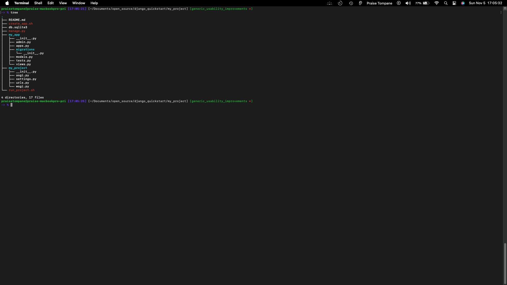
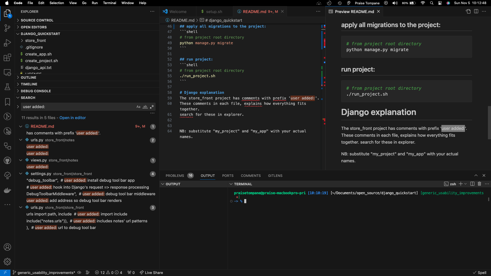

# app_django_quickstart
## objectives:
- facade to reduce Django command ceremony typing.
- user notes for quick reference.

## setup instructions
- uses devcontainers

# usage
**NB**: substitute "my_project" and "my_app" with your actual names.

## create project:
```shell
# from django_quickstart root directory
./create_project.sh my_project
```
- this creates the following:
   - a Django project folder called my_project.
   - installs two scripts:
      - create_app.sh: a shorthand to create a Django app for your project
      - run_project.sh: a shorthand to run your Django project

## create app:
- move to project root folder:
    ```shell
    # from django_quickstart root directory
    cd my_project
    ```
- create app(s):
    ```shell
    # from my_project root directory
    ./create_app.sh my_app
    ```

- apply all migrations to the project:
    ```shell
    # from my_project root directory
    python manage.py migrate
    ```
- project state after this:


## run project:
```shell
# from my_project root directory
./run_project.sh
```

## Django explanation
The `my_project` project and `my_app` app have comments with prefix 'user added:'. <br>
These comments explain how everything fits together. <br>
Search for these in explorer. <br>
example: <br>


